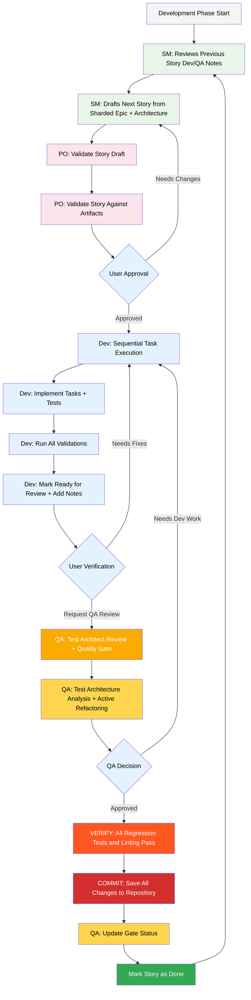

# PRISM Development Workflow

## Overview
PRISM follows a structured, unambiguous development workflow with mandatory quality gates at each stage. There are no optional steps - every story follows the same rigorous process.

## Planning Artifacts (Standard Paths)
All planning documents must be placed in these exact locations:

| Artifact Type | Standard Path | Description |
|--------------|---------------|-------------|
| PRD | `docs/prd.md` | Product Requirements Document |
| Architecture | `docs/architecture.md` | System Architecture Document |
| Sharded Epics | `docs/epics/` | Epic breakdown documents |
| Sharded Stories | `docs/stories/` | Individual story files |
| QA Assessments | `docs/qa/assessments/` | Quality assessment reports |
| QA Gates | `docs/qa/gates/` | Quality gate decisions |

## Core Development Cycle

### Workflow Diagram



## Stage-by-Stage Process

### 1. Story Planning (SM Agent)
**Command**: `/sm`

1. Review previous story's Dev and QA notes for lessons learned
2. Draft next story from sharded epic using `*draft` command
3. Ensure story includes:
   - Clear acceptance criteria
   - Properly sized tasks (1-3 days)
   - Test requirements
   - Dependencies identified

### 2. Story Validation (PO Agent)
**Command**: `/po`

**MANDATORY** - Every story must be validated before development:
1. Run `*validate-story-draft {story}` command
2. Verify story aligns with:
   - PRD requirements
   - Architecture design
   - Epic objectives
   - Previous story completions
3. Document any changes needed

### 3. User Approval Gate
**Manual Step**

1. User reviews validated story
2. Either:
   - **Approve**: Proceed to development
   - **Request Changes**: Return to SM for revision

### 4. Development Execution (Dev Agent)
**Command**: `/dev {story-file}`

1. Run `*develop-story` command
2. Sequential task execution:
   - Read task → Implement → Test → Validate → Mark complete
   - Repeat for each task in story
3. Follow PRISM principles:
   - **P**redictability: Consistent patterns
   - **R**esilience: Comprehensive error handling
   - **I**ntentionality: Clear code purpose
   - **S**ustainability: Long-term maintainability
   - **M**aintainability: Easy to modify

### 5. Validation & Testing (Dev Agent)
**Automatic within Dev workflow**

1. Run all unit tests
2. Execute integration tests
3. Perform linting checks
4. Run regression suite
5. Update story with:
   - File list (all modified files)
   - Change log
   - Debug notes
   - Mark as "Ready for Review"

### 6. Quality Review (QA Agent)
**Command**: `/qa`

**MANDATORY** QA review includes:
1. Run `*review {story}` command
2. Test architecture analysis
3. Requirements traceability check
4. Risk assessment
5. Create quality gate decision

### 7. Quality Gate Decision
**QA Agent Output**

Three possible outcomes:
1. **PASS**: Story meets all quality criteria
2. **CONCERNS**: Minor issues but can proceed
3. **FAIL**: Must return to Dev for fixes

### 8. Final Verification
**Critical Steps**

1. **Verify** all regression tests pass
2. **Verify** all linting passes
3. **Commit** changes to repository
4. **Update** gate status via `*gate` command

### 9. Story Completion
**Final Steps**

1. Mark story as "Done"
2. Document lessons learned
3. Return to step 1 for next story

## Command Quick Reference

### Story Master (SM)
- `/sm` - Activate Story Master agent
- `*decompose {epic}` - Break down epic into stories
- `*draft` - Create new story from epic
- `*story-checklist` - Run story draft checklist

### Product Owner (PO)
- `/po` - Activate Product Owner agent
- `*validate-story-draft {story}` - Validate story (MANDATORY)
- `*execute-checklist-po` - Run PO master checklist

### Developer (Dev)
- `/dev {story}` - Start development on story
- `*develop-story` - Execute story implementation
- `*run-tests` - Execute all tests
- `*review-qa` - Apply QA fixes

### QA Test Architect (QA)
- `/qa` - Activate QA agent
- `*review {story}` - Comprehensive story review
- `*gate {story}` - Create/update quality gate
- `*trace {story}` - Requirements traceability
- `*nfr-assess {story}` - Non-functional requirements check

## Quality Gates & Checkpoints

### Mandatory Gates
1. **PO Validation** - Every story must be validated
2. **User Approval** - Explicit approval before dev
3. **Dev Completion** - All tasks done with tests
4. **QA Review** - Comprehensive quality check
5. **Final Verification** - Regression & linting pass

### No Exceptions
- No skipping validation
- No proceeding without approval
- No merging without passing tests
- No completion without QA review
- No story done without gate update

## File Organization

### Story Files
```
docs/stories/
├── epic-001/
│   ├── story-001-user-authentication.md
│   ├── story-002-password-reset.md
│   └── story-003-session-management.md
├── epic-002/
│   ├── story-004-product-catalog.md
│   └── story-005-search-filters.md
```

### QA Artifacts
```
docs/qa/
├── assessments/
│   ├── story-001-assessment.md
│   ├── story-002-assessment.md
├── gates/
│   ├── epic-001.story-001-gate.yml
│   ├── epic-001.story-002-gate.yml
```

## PRISM Principles in Practice

### During Development
- **Predictability**: Use established patterns from architecture
- **Resilience**: Add comprehensive error handling
- **Intentionality**: Write self-documenting code
- **Sustainability**: Consider long-term maintenance
- **Maintainability**: Keep complexity manageable

### During Review
- Code follows PRISM principles
- Tests cover all scenarios
- Documentation is complete
- No technical debt introduced
- Performance requirements met

## Troubleshooting

### Common Issues

| Issue | Solution |
|-------|----------|
| Story too large | Return to SM for decomposition |
| Validation fails | PO reviews against artifacts |
| Tests failing | Dev fixes before proceeding |
| QA gate fails | Dev addresses all issues |
| Regression fails | No commit until fixed |

### Escalation Path
1. Dev blockers → SM for clarification
2. Requirement issues → PO for validation
3. Architecture concerns → Architect review
4. Quality concerns → QA deep review

## Summary

PRISM workflow ensures:
- **Consistent** story development
- **Mandatory** quality gates
- **No ambiguity** in process
- **Clear** accountability
- **Traceable** decisions

Every story follows the exact same path with no optional steps or shortcuts. This ensures predictable, high-quality delivery aligned with PRISM principles.

---
*PRISM Development Workflow - Version 1.0*