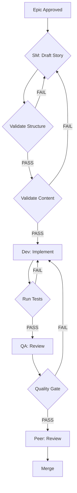

# Workflows - Multi-Step Orchestration with Role Handoffs

> **Level 1**: What workflows are and how they orchestrate complexity

---

## What Are Workflows?

Workflows are **multi-step processes** that orchestrate role handoffs, quality gates, and sequential operations. They connect different roles (SM → Dev → QA → Peer) with clear entry/exit criteria and validation checkpoints.

**Key characteristic:** Structured handoffs between roles with quality gates preventing progression until criteria met.

---

## Why Workflows Matter

### The Problem: Implicit Handoffs

**Without workflows:**
```
SM: "Story looks done"
Dev: "I'll start implementing... wait, what's the acceptance criteria?"
QA: "Tests pass... I think? Not sure what to verify"
Peer: "Code looks okay... should I check tests too?"

Result: Confusion, rework, missed requirements
```

### The Solution: Explicit Workflows

**With workflows:**
```
SM Phase:
  Entry: Epic approved
  Execute: Draft story, validate structure/content/alignment
  Quality Gates: story-structure-validator, story-content-validator
  Exit: Story quality score ≥85, all validations pass
  Handoff: Story file + AC + tasks → Dev

Dev Phase:
  Entry: Story approved (SM exit criteria met)
  Execute: Implement with TDD, run tests
  Quality Gates: file-list-auditor, test-runner, lint-checker
  Exit: All tests pass, coverage ≥80%, lint clean
  Handoff: Implementation + tests → QA

QA Phase:
  Entry: Dev complete (Dev exit criteria met)
  Execute: Verify requirements, assess quality
  Quality Gates: requirements-tracer, qa-gate-manager
  Exit: Requirements traced, quality gate = PASS
  Handoff: QA approval → Peer

Peer Phase:
  Entry: QA approved
  Execute: Code review, architectural assessment
  Exit: Approved for merge
  Handoff: Ready for production
```

---

## PRISM's Core Development Workflow

The **[Core Development Cycle](../workflows/core-development-cycle.md)** is PRISM's primary workflow:

```
┌──────────────┐
│ Story Master │ → Plan & estimate
└──────┬───────┘
       │ Handoff: Story approved
       ▼
┌──────────────┐
│  Developer   │ → Implement with TDD
└──────┬───────┘
       │ Handoff: Tests passing
       ▼
┌──────────────┐
│  QA Engineer │ → Validate quality
└──────┬───────┘
       │ Handoff: Quality approved
       ▼
┌──────────────┐
│ Peer Reviewer│ → Review & approve
└──────────────┘
```

---

## Workflow Anatomy

### 1. Phase Definition

Each workflow phase has:

```yaml
phase: "Story Master"
entry_criteria:
  - Epic approved in Jira
  - Architecture patterns documented
  - No blocking dependencies

execution_steps:
  - Load epic context
  - Apply story template
  - Draft acceptance criteria
  - Size tasks with PROBE

quality_gates:
  - story-structure-validator: Template compliance
  - story-content-validator: Quality score ≥85
  - epic-alignment-checker: No scope creep
  - architecture-compliance-checker: Tech stack approved

exit_criteria:
  - All quality gates PASS
  - Story has 3-7 measurable AC
  - Tasks sized (S/M/L/XL)
  - Quality score ≥85

handoff:
  to: "Developer"
  artifacts:
    - Story file (docs/stories/epic-XXX/story-XXX.md)
    - Acceptance criteria (clear, measurable)
    - Sized tasks (implementation guidance)
```

### 2. Handoff Protocol

```
Phase A Exit
  ↓
Verify all exit criteria met
  ↓
Package artifacts for next phase
  ↓
Phase B Entry
  ↓
Verify all entry criteria met
  ↓
Begin Phase B execution
```

### 3. Quality Gates

```
Execution step complete
  ↓
Trigger quality gate (sub-agent)
  ↓
Sub-agent validates in isolation
  ↓
Returns PASS/FAIL + issues
  ↓
PASS → Continue to next step
FAIL → Address issues, re-validate
```

---

## Workflow File Structure

### YAML Definition

```yaml
# workflows/my-workflow.yml
name: "Feature Development Workflow"
description: "End-to-end feature implementation"

phases:
  - name: "Planning"
    role: "Story Master"
    command: "/sm"
    entry_criteria:
      - Epic approved
    execution:
      - step: "Draft story"
        task: "draft-story"
      - step: "Validate structure"
        sub_agent: "story-structure-validator"
    exit_criteria:
      - Story validated
    handoff:
      to: "Development"
      artifacts:
        - "Story file with AC"

  - name: "Development"
    role: "Developer"
    command: "/dev"
    entry_criteria:
      - Story approved
    execution:
      - step: "Implement with TDD"
        task: "develop-story"
      - step: "Run tests"
        sub_agent: "test-runner"
    exit_criteria:
      - Tests pass
      - Coverage ≥80%
    handoff:
      to: "QA Review"
      artifacts:
        - "Implementation + tests"
```

### Markdown Documentation

```markdown
# workflows/my-workflow.md

# Feature Development Workflow

[Level 1: Overview of workflow]

## Phase 1: Planning (Story Master)

**Entry Criteria:**
- Epic approved

**Steps:**
1. Draft story using template
2. Validate structure

**Quality Gates:**
- story-structure-validator

**Exit Criteria:**
- Story validated

**Handoff to Development:**
- Story file with acceptance criteria

## Phase 2: Development (Developer)

[Continue for each phase...]
```

### Mermaid Diagram



---

## Workflow Patterns

### Pattern 1: Linear Progression

**Use case:** Simple feature development

```
SM → Dev → QA → Peer → Merge
```

Each phase completes before next begins.

### Pattern 2: Parallel Tracks

**Use case:** Independent features

```
         ┌─ Dev A ─┐
SM → Epic├─ Dev B ─┤→ QA → Merge
         └─ Dev C ─┘
```

Multiple devs work in parallel on same epic.

### Pattern 3: Iterative Refinement

**Use case:** Complex features with feedback loops

```
SM → Dev → QA → Issues found?
          ↑       ↓ YES
          └───────┘
```

Loop back to Dev until QA passes.

### Pattern 4: Conditional Branching

**Use case:** Risk-based testing

```
Dev → Tests Pass?
       ├─ YES → Peer Review
       └─ NO  → Dev (fix)
```

Different paths based on validation results.

---

## PRISM Example: Core Development Cycle

### Full Workflow

See **[Core Development Cycle](../workflows/core-development-cycle.md)** for complete implementation.

### Key Phases

**1. Story Master Phase**
```bash
/sm
*draft story-001

# Triggers quality gates:
- story-structure-validator
- story-content-validator
- epic-alignment-checker
- architecture-compliance-checker

# Exit criteria:
- Quality score ≥85
- All AC measurable
- Tasks sized
```

**2. Developer Phase**
```bash
/dev story-001
*develop-story

# Triggers quality gates:
- file-list-auditor (changes match story?)
- test-runner (tests pass? coverage?)
- lint-checker (standards met?)

# Exit criteria:
- All tests pass
- Coverage ≥80%
- Lint clean
```

**3. QA Phase**
```bash
/qa story-001
*review story-001

# Triggers quality gates:
- requirements-tracer (PRD → code → tests?)
- qa-gate-manager (quality decision documented?)

# Exit criteria:
- Requirements traced
- Quality gate YAML = PASS
```

**4. Peer Review Phase**
```bash
/peer
*review story-001

# Manual review:
- Code quality
- Architecture alignment
- Test coverage adequacy

# Exit criteria:
- Peer approval
- No blocking issues
```

---

## Building a Workflow

### Step 1: Define Phases

```yaml
phases:
  - name: "Phase Name"
    role: "Role Persona"
    command: "/command-to-activate"
```

### Step 2: Set Entry Criteria

```yaml
entry_criteria:
  - "What must be true to start this phase"
  - "Previous phase exit criteria"
  - "External dependencies met"
```

### Step 3: Define Execution

```yaml
execution:
  - step: "Human-readable step name"
    task: "task-file-name"  # or
    sub_agent: "sub-agent-name"  # or
    workflow: "nested-workflow"  # or
    manual: "Manual operation description"
```

### Step 4: Add Quality Gates

```yaml
quality_gates:
  - name: "sub-agent-name"
    required: true  # Block progression if FAIL
    # or
    required: false  # Warn but allow progression
```

### Step 5: Set Exit Criteria

```yaml
exit_criteria:
  - "What must be true to complete this phase"
  - "All quality gates PASS"
  - "Artifacts ready for handoff"
```

### Step 6: Define Handoff

```yaml
handoff:
  to: "Next Phase Name"
  artifacts:
    - "File or document to pass along"
    - "Context to preserve"
  context:
    - "Important notes for next role"
```

---

## Workflows + Other Features

### Workflows + Commands

**Commands activate workflow phases:**

```bash
/sm     # Activates SM workflows
  → *draft
  → *resize

/dev    # Activates Dev workflows
  → *develop-story
  → *review-qa
```

### Workflows + Sub-Agents

**Sub-agents validate at checkpoints:**

```
Workflow execution step
  ↓
Trigger sub-agent validation
  ↓ (isolated execution)
Sub-agent returns result
  ↓
PASS → Next step
FAIL → Fix issues, retry
```

### Workflows + Hooks

**Hooks enforce workflow transitions:**

```python
# Hook prevents skipping phases
if command == "/qa":
    if not context.get("dev_complete"):
        return BLOCK("Complete /dev phase first")
```

### Workflows + Tasks

**Tasks are workflow building blocks:**

```yaml
execution:
  - step: "Estimate story"
    task: "probe-estimation"  # Reusable task
  - step: "Design tests"
    task: "test-design"       # Reusable task
```

---

## Best Practices

### ✅ DO

- **Clear entry/exit criteria** - No ambiguity about phase completion
  ```yaml
  exit_criteria:
    - All tests pass (run `npm test`)
    - Coverage ≥80% (check coverage report)
    - Lint clean (run `npm run lint`)
  ```

- **Explicit handoffs** - Document what next phase receives
  ```yaml
  handoff:
    artifacts:
      - "Story file: docs/stories/epic-001/story-003.md"
      - "AC: 5 measurable criteria in story"
      - "Tests: All passing, coverage report attached"
  ```

- **Quality gates at natural checkpoints** - After major steps
  ```yaml
  - step: "Implement feature"
  - step: "Run quality gates"  ← Checkpoint
    sub_agent: "test-runner"
  ```

- **Visual diagrams** - Mermaid flowcharts help understanding
  ```markdown
  ## Workflow Diagram
  \```mermaid
  graph TD
    A[Start] --> B[Step 1]
  \```
  ```

### ❌ DON'T

- **Skip entry criteria** - Causes confusion about when to start
- **Vague exit criteria** - "Story looks good" is not measurable
- **Too many phases** - 3-5 phases ideal, >7 phases too complex
- **Missing handoff artifacts** - Next phase doesn't know what it received
- **Quality gates without automation** - Manual gates create bottlenecks

---

## Troubleshooting

### Phase Transitions Unclear?

**Add explicit criteria:**
```yaml
# Before (vague)
exit_criteria:
  - Story done

# After (specific)
exit_criteria:
  - Story file exists: docs/stories/epic-001/story-003.md
  - story-structure-validator: PASS
  - story-content-validator: score ≥85
  - All AC are measurable (Given/When/Then format)
```

### Quality Gates Slowing Down Workflow?

**Optimize sub-agent execution:**
```yaml
# Use fast model for simple checks
quality_gates:
  - name: "story-structure-validator"
    model: "haiku"  # Fast for structural checks

  - name: "requirements-tracer"
    model: "sonnet"  # Needs reasoning
```

### Too Much Rework?

**Add earlier quality gates:**
```yaml
# Before: Validate at end
- Implement all features
- Run all quality gates  ← Too late, lots of rework

# After: Validate incrementally
- Implement feature A
- Validate feature A  ← Catch issues early
- Implement feature B
- Validate feature B  ← Incremental validation
```

---

## Comparison: Workflows vs Other Features

| Feature | Purpose | Orchestration | Quality Gates | Role Handoffs |
|---------|---------|---------------|---------------|---------------|
| **Workflows** | Multi-step processes | ✅ Yes | ✅ Yes | ✅ Yes |
| **Commands** | Load single role | ❌ No | ⚠️ Manual | ❌ No |
| **Skills** | Auto-activate role | ❌ No | ⚠️ Manual | ❌ No |
| **Sub-Agents** | Isolated validation | ❌ No | ✅ Yes | ❌ No |
| **Tasks** | Single operation | ❌ No | ❌ No | ❌ No |

**Key insight:** Workflows are the **only** feature that orchestrates multiple roles with automatic quality gates.

---

## Related Documentation

- **[Commands](./slash-commands.md)** - Activate workflow phases
- **[Sub-Agents](./sub-agents.md)** - Quality gate validators
- **[Tasks](./tasks.md)** - Workflow building blocks
- **[Core Development Cycle](../workflows/core-development-cycle.md)** - Primary PRISM workflow

---

## Examples in PRISM

**Workflow Implementations:**
- [Core Development Cycle](../workflows/core-development-cycle.md)
- [All Workflows](../workflows/README.md)

**Workflow Directory:**
```
workflows/
├── core-development-cycle.md     # Primary workflow
├── README.md                      # Workflow index
└── [other-workflows].md
```

---

**Last Updated**: 2025-11-10
**PRISM Version**: 1.7.1
