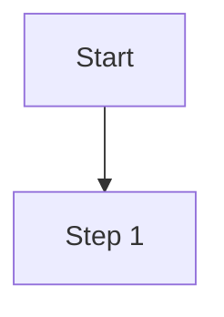

# PRISM Workflow Automation

## Overview

PRISM workflows automate multi-step development processes using **skills**, **templates**, and **config files**. This follows Claude Code's workflow automation conventions with structured, reusable components.

## Workflow Structure

Workflows are defined in YAML files that orchestrate:
- **Skills**: Specialized agent capabilities (from `skills/` directory)
- **Templates**: Document generation patterns (from `templates/` directory)
- **Config**: Project settings and workflow parameters (from `core-config.yaml`)

### Directory Layout

```
docs/reference/workflows/
├── README.md                           # This file
├── core-development-cycle.md           # Main PRISM development process (visual documentation)
└── ../../workflows/
    ├── core-development-cycle.yaml     # Executable workflow definition
    ├── strangler-pattern-migration.yaml # Brownfield migration workflow
    └── [other-workflows].yaml          # Additional workflows
```

## Workflow Components

### 1. Skills

**Skills** are Claude's specialized capabilities defined in `skills/` directory. Each skill provides focused expertise that workflows invoke.

**Available Skills:**
- `architect/` - System design and architecture
- `dev/` - Development and implementation
- `qa/` - Quality assurance and testing
- `po/` - Product owner and requirements
- `sm/` - Story sizing and planning
- `peer/` - Code review and mentoring
- `support/` - Issue validation and support

**How Skills Work:**
- Auto-activate based on context mentions
- Invoke via slash commands: `/architect`, `/dev`, `/qa`, etc.
- Each skill has `SKILL.md` (quick reference) + `reference/` (detailed guides)

**How Workflows Invoke Skills:**

Workflows trigger skills through natural language or command names. Skills use progressive disclosure to load detailed instructions:

```yaml
sequence:
  - step: architecture_design
    agent: architect                    # Activates architect skill
    action: create_architecture         # Maps to command in skills/architect/SKILL.md
    notes: |
      The create_architecture command:
      - Reads skills/architect/SKILL.md (core skill definition)
      - Loads skills/architect/reference/commands.md (detailed command instructions)
      - Loads skills/architect/reference/architecture-workflow.md (workflow guidance)
      - Progressively reveals information as needed

  - step: implementation
    agent: dev                          # Activates dev skill
    action: implement_feature           # Maps to command in skills/dev/SKILL.md
```

**File Structure for Progressive Disclosure:**
```
skills/architect/
├── SKILL.md                           # Core skill (<2k tokens)
│   └── Lists available commands
└── reference/
    ├── commands.md                    # Detailed command documentation
    └── architecture-workflow.md       # Workflow guidance
```

### 2. Templates

**Templates** provide consistent document generation using handlebars-style variables.

**Template Location:** `templates/` directory

**Template Variables:**
- `{{projectName}}` - Project name from config
- `{{epicId}}` - Epic identifier
- `{{storyId}}` - Story identifier
- `{{date}}` - Current date
- Custom variables defined per template

**Common Templates:**
- PRD (Product Requirements Document)
- User Stories
- Architecture Decision Records (ADR)
- Test Plans
- QA Assessments

**Example Template Usage:**
```yaml
artifacts:
  created:
    - location: docs/stories/{{epicId}}.{{storyId}}.md
      template: story-template.md
      description: Generated user story
```

### 3. Configuration

**Config Location:** `core-config.yaml` (project root)

**Config Defines:**
- Project paths and structure
- Artifact output locations
- Template mappings
- Integration settings (Jira, etc.)
- Workflow parameters

**Example Config:**
```yaml
project:
  name: MyProject
  paths:
    stories: docs/stories
    architecture: docs/architecture
    qa: docs/qa

workflows:
  templates:
    story: templates/story.md
    prd: templates/prd.md

  artifacts:
    stories: docs/stories
    assessments: docs/qa/assessments
```

## Creating a Workflow

### Basic Workflow Structure

```yaml
workflow:
  id: workflow-name
  name: Human-Readable Workflow Name
  description: What this workflow does
  type: greenfield|brownfield
  documentation: workflows/workflow-name.md  # Link to visual documentation

  sequence:
    - step: step_name
      agent: architect|dev|qa|po|sm|peer|support
      action: action_to_perform
      uses: skill-task-name
      requires: previous_step_name  # Optional dependency
      notes: |
        Instructions for this step

artifacts:
  created:
    - location: output/path/file.md
      description: What gets created

  required:
    - resource-name
    - another-resource

validation:
  checklist: validation-checklist-name
  success_criteria:
    - Criterion 1
    - Criterion 2
```

### Workflow Execution

Workflows execute by invoking skill commands. Each command is defined in the skill's file structure:

```bash
# Invoke architect skill with create-architecture command
/architect create-architecture
# → Loads skills/architect/SKILL.md
# → Progressively loads reference/commands.md for detailed instructions

# Invoke dev skill with task command
/dev *task strangler-pattern
# → Loads skills/dev/SKILL.md
# → Loads specific task instructions from reference/

# Invoke QA skill with risk assessment
/qa *risk story-id
# → Loads skills/qa/SKILL.md
# → Loads reference/risk-assessment.md for methodology
```

**Progressive Disclosure Pattern:**
1. Workflow references command name (e.g., `create-architecture`)
2. Skill's SKILL.md lists available commands (<2k tokens)
3. Detailed instructions load from `reference/` directory as needed
4. Only loads what's necessary for the current step

## Workflow Patterns

### Pattern 1: Greenfield Development

New projects with no existing codebase.

```yaml
workflow:
  type: greenfield
  sequence:
    - step: requirements
      agent: po
      action: create-prd              # Maps to skills/po/SKILL.md command

    - step: architecture
      agent: architect
      action: create-architecture     # Maps to skills/architect/SKILL.md command
      requires: requirements
      notes: |
        Loads skills/architect/reference/commands.md for detailed instructions
        Progressively loads architecture-workflow.md for process guidance

    - step: implementation
      agent: dev
      action: develop                 # Maps to skills/dev/SKILL.md command
      requires: architecture
```

### Pattern 2: Brownfield Development

Modifications to existing systems.

```yaml
workflow:
  type: brownfield
  sequence:
    - step: document_existing
      agent: architect
      action: document-project        # Maps to skills/architect/SKILL.md command
      notes: |
        Loads skills/architect/reference/commands.md for documentation methodology

    - step: risk_assessment
      agent: qa
      action: risk-profile            # Maps to skills/qa/SKILL.md command (short: *risk)
      requires: document_existing
      notes: |
        Loads skills/qa/reference/risk-assessment.md for detailed methodology

    - step: safe_implementation
      agent: dev
      action: develop                 # Maps to skills/dev/SKILL.md command
      requires: risk_assessment
```

### Pattern 3: Test-Driven Development

Behavior-first methodology.

```yaml
workflow:
  sequence:
    - step: capture_behavior
      agent: dev
      action: task                    # Generic task command from skills/dev/SKILL.md
      uses: strangler-pattern         # Specific task name
      notes: |
        Loads skills/dev/reference/tasks/strangler-pattern.md
        Uses progressive disclosure for TDD methodology

    - step: write_tests
      agent: dev
      action: develop                 # Maps to skills/dev/SKILL.md command
      requires: capture_behavior
      notes: Create failing tests (RED state)

    - step: implement
      agent: dev
      action: develop                 # Maps to skills/dev/SKILL.md command
      requires: write_tests
      notes: Make tests pass (GREEN state)

    - step: validate
      agent: qa
      action: review                  # Maps to skills/qa/SKILL.md command
      requires: implement
      notes: |
        Loads skills/qa/reference/review-methodology.md
        Validates test coverage and quality
```

## Workflow vs Skills vs Commands

### Skills
- **What:** Specialized agent capabilities with progressive disclosure
- **Location:** `skills/{agent}/SKILL.md` + `skills/{agent}/reference/*.md`
- **Structure:**
  - `SKILL.md` - Core commands (<2k tokens)
  - `reference/` - Detailed instructions (loaded as needed)
- **Activation:** Auto-context or `/command`
- **Purpose:** Provide focused expertise domains

### Commands
- **What:** Direct agent invocation slash commands
- **Location:** `commands/` directory
- **Activation:** `/architect`, `/dev`, `/qa`, etc.
- **Purpose:** Activate agent skill context
- **Loads:** Corresponding `skills/{agent}/SKILL.md`

### Workflows
- **What:** Multi-step orchestrated processes
- **Location:** `workflows/` directory
- **Action References:** Command names from skills (e.g., `create-architecture`)
- **Execution:** Invokes skill commands in sequence
- **Purpose:** Automate complex sequences

**Relationship with Progressive Disclosure:**
```
Workflow YAML
  ↓
References action: "create-architecture"
  ↓
Loads skills/architect/SKILL.md (core)
  ↓
Progressively loads skills/architect/reference/commands.md (details)
  ↓
Uses templates/ for document generation
  ↓
Follows core-config.yaml settings
```

## Workflow Documentation Strategy

### Dual-File Pattern

Each workflow uses two complementary files:

#### YAML File (`workflow-name.yaml`)
**Purpose:** Executable workflow definition
- Structured sequence of steps with dependencies
- Explicit skill command mappings
- Progressive disclosure references
- Artifacts and validation criteria
- Success gates and decision trees

**Example:**
```yaml
workflow:
  id: workflow-name
  name: Human-Readable Workflow Name
  documentation: docs/reference/workflows/workflow-name.md  # Link to visual docs

  sequence:
    - step: draft_story
      agent: sm
      action: draft                    # Maps to skills/sm/SKILL.md
      notes: |
        Loads skills/sm/reference/epic-decomposition.md
        Creates story in docs/stories/
```

#### Markdown File (`workflow-name.md`)
**Purpose:** Visual documentation and guidance
- Mermaid workflow diagrams for visualization
- Detailed explanations and scenarios
- Decision trees and flowcharts
- Troubleshooting and best practices
- Examples and common patterns

**Example Structure:**
```markdown
# Workflow Name

> **Executable:** See [workflow-name.yaml](workflow-name.yaml)

## File Organization
- YAML: Executable workflow
- Markdown: Visual documentation

## Visual Workflow


## Scenarios
...
```

### Why Separate Files?

**YAML Advantages:**
- Machine-parseable structure
- Clear dependency chains
- Explicit command references
- Can be validated and tested
- ⚠️ **Note:** Mermaid diagrams don't render in YAML

**Markdown Advantages:**
- ✅ Renders Mermaid diagrams visually
- Better for long-form explanations
- Rich formatting and examples
- Easier to read for documentation

**Division of Responsibility:**

| Content | YAML File | Markdown File |
|---------|-----------|---------------|
| Workflow sequence | ✅ | Reference only |
| Skill command mappings | ✅ | Explanation |
| Progressive disclosure refs | ✅ | - |
| Dependencies & requires | ✅ | - |
| Artifacts & validation | ✅ | - |
| **Mermaid diagrams** | ❌ | ✅ |
| Scenarios & examples | - | ✅ |
| Troubleshooting | - | ✅ |
| Best practices | - | ✅ |

**File Structure:**
```
.prism/
├── workflows/
│   ├── core-development-cycle.yaml    # Executable: skill commands, dependencies
│   └── strangler-pattern-migration.yaml
└── docs/reference/workflows/
    ├── core-development-cycle.md      # Visual: Mermaid diagrams, scenarios
    ├── strangler-pattern-migration.md # (if exists)
    └── README.md                      # This file
```

## Best Practices

### 1. Reference Skill Commands Explicitly

Workflow actions must map to commands defined in skill files:

```yaml
sequence:
  - step: create_story
    agent: po                         # Activates skills/po/SKILL.md
    action: create-story              # Must exist as command in SKILL.md
    notes: |
      Maps to create-story command
      Loads skills/po/reference/story-creation.md for details
```

**Verify Command Exists:**
1. Check `skills/{agent}/SKILL.md` for available commands
2. Reference the exact command name in workflow `action:`
3. Document which reference files will be loaded

### 2. Use Templates for Document Generation

Keep workflows declarative by using templates for document generation:

```yaml
artifacts:
  created:
    - location: docs/stories/{{epic}}.{{story}}.md
      template: story-template.md
      variables:
        epic: "{{epicId}}"
        story: "{{storyId}}"
        author: "{{author}}"
```

### 3. Define Dependencies

Use `requires:` to ensure proper execution order:

```yaml
sequence:
  - step: design
    agent: architect

  - step: implement
    agent: dev
    requires: design    # Won't run until design completes
```

### 4. Document Artifacts

Always specify what gets created:

```yaml
artifacts:
  created:
    - location: docs/output.md
      description: What this file contains
  required:
    - input-file.md
    - reference-doc.md
```

### 5. Include Validation

Define success criteria for quality gates:

```yaml
validation:
  checklist: workflow-validation
  success_criteria:
    - All tests pass
    - Documentation complete
    - Code review approved
```

## PRISM Workflow Structure

PRISM workflows use a skill-based architecture:

```
.prism/
├── skills/
│   ├── po/SKILL.md           # Story generation skill
│   └── dev/SKILL.md          # Development skill with test tasks
├── templates/
│   └── story-template.md     # Story generation template
├── workflows/
│   └── story-workflow.yaml   # Orchestration
└── core-config.yaml          # Configuration
```

Each component has a clear purpose:
- **Skills** provide agent capabilities
- **Templates** define document structure
- **Workflows** orchestrate multi-step processes
- **Config** holds project settings

## Example Workflows

### Example 1: Feature Development

```yaml
workflow:
  id: feature-development
  name: Complete Feature Development Cycle
  type: greenfield

  sequence:
    - step: plan
      agent: po
      action: create_story
      uses: story-creation

    - step: design
      agent: architect
      action: design_feature
      requires: plan

    - step: implement
      agent: dev
      action: implement_feature
      requires: design

    - step: test
      agent: qa
      action: validate_feature
      requires: implement

    - step: review
      agent: peer
      action: code_review
      requires: test
```

### Example 2: Bug Fix

```yaml
workflow:
  id: bug-fix-process
  name: Bug Investigation and Fix
  type: brownfield

  sequence:
    - step: validate
      agent: support
      action: validate_issue

    - step: assess
      agent: qa
      action: risk_profile
      requires: validate

    - step: fix
      agent: dev
      action: implement_fix
      requires: assess

    - step: verify
      agent: qa
      action: regression_check
      requires: fix
```

## Integration with PRISM Core

Workflows integrate with the PRISM development cycle:

1. **Planning Phase** → PO and SM skills
2. **Design Phase** → Architect skills
3. **Implementation** → Dev skills
4. **Quality Gates** → QA skills
5. **Review** → Peer skills

See [core-development-cycle.md](./core-development-cycle.md) for the complete process.

## Additional Resources

- **Skills Documentation:** `skills/[agent]/SKILL.md`
- **Templates:** `templates/` directory
- **Config Reference:** `core-config.yaml`
- **PRISM Methodology:** `PRISM-METHODOLOGY.md`
- **Development Workflow:** `docs/prism-workflow.md`

## Troubleshooting

### Workflow not executing
- Verify skill exists in `skills/` directory
- Check agent name matches available agents
- Ensure required dependencies are met

### Template variables not replaced
- Confirm variables defined in `core-config.yaml`
- Check template syntax: `{{variableName}}`
- Verify template path in workflow

### Artifacts not generated
- Check output path exists or can be created
- Verify template location in `templates/`
- Review permissions on output directory

---

**PRISM™** - Structured workflows through skills, templates, and configuration
