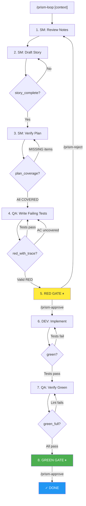

# PRISM Automated TDD Workflow (prism-loop)

> **Skill Definition:** See [prism-loop SKILL.md](../../../skills/prism-loop/SKILL.md) for commands and usage.

## Overview

The prism-loop automates TDD development with validation gates. Unlike the manual [Core Development Cycle](./core-development-cycle.md), prism-loop auto-progresses through steps using stop hooks.

**Key Feature:** Tests serve as an audit of the plan - if an acceptance criterion has no test, the workflow blocks.

---

## Visual Workflow



---

## Requirements Traceability

The workflow enforces end-to-end traceability:

```
User Request → [Step 1] → Requirements → [Step 2] → Acceptance Criteria
                          REQ-1, REQ-2              AC-1 → REQ-1

[Step 3] → Plan Coverage (all REQs mapped) → [Step 4] → Tests
           REQ → AC verified                            test_ac1 → AC-1
```

### Validation Chain

| Exit Point | Validation | Blocks If |
|------------|------------|-----------|
| Step 2 | `story_complete` | Story file missing or no ACs found |
| Step 3 | `plan_coverage` | Any requirement is MISSING from Plan Coverage |
| Step 4 | `red_with_trace` | Tests pass (should fail) OR any AC lacks a test |

### Silent Drop Prevention

If the AI drafts a story that misses a requirement, or writes tests that miss an AC, the workflow **blocks** with explicit feedback:

```
SILENT DROP DETECTED

These acceptance criteria have NO corresponding tests:
  - AC-3: User can reset password

Write tests for ALL uncovered ACs before proceeding.
```

---

## Commands

| Command | Purpose |
|---------|---------|
| `/prism-loop [context]` | Start workflow with optional context |
| `/prism-status` | Check current step position |
| `/prism-approve` | Approve gate and advance |
| `/prism-reject` | Reject at red_gate, loop to step 1 |
| `/cancel-prism` | Stop workflow |

---

## Gate Decisions

### At RED Gate (Step 5)

**Approve if:**
- All ACs have test coverage (trace audit passed)
- Tests fail with assertion errors (not syntax errors)
- Story requirements are clear

**Reject if:**
- Tests need redesign
- Requirements need clarification
- Loops back to step 1 (planning)

### At GREEN Gate (Step 8)

**Approve if:**
- All tests pass
- Lint checks pass
- Ready to commit

---

## Troubleshooting

### "Tests are passing but should FAIL"
You're in RED phase - tests must fail. Add assertions that will fail until implementation.

### "AC-X has no test coverage"
The trace audit found an AC without a corresponding test. Name your test with the AC ID: `test_ac1_...` or add `# AC-1` comment.

### "Story missing Acceptance Criteria"
The draft_story validation requires an `## Acceptance Criteria` section with numbered ACs.

---

## Related

- [Core Development Cycle](./core-development-cycle.md) - Manual brownfield workflow
- [prism-loop SKILL.md](../../../skills/prism-loop/SKILL.md) - Full skill definition
- [Hooks System](../../../hooks/README.md) - How stop hooks enforce validation

---

**PRISM™** - *Automated TDD with traceability*
