# PRISM Core Development Cycle

> **Executable Workflow:** See [core-development-cycle.yaml](core-development-cycle.yaml) for the structured workflow definition with explicit skill command mappings and progressive disclosure references.

## File Organization

This workflow has two complementary files:

### 📋 [core-development-cycle.yaml](core-development-cycle.yaml)
**Purpose:** Executable workflow definition
- Structured YAML sequence of steps
- Explicit skill command mappings (e.g., `action: draft` → `skills/sm/SKILL.md`)
- Progressive disclosure references (which reference files load)
- Artifacts, validation criteria, and success gates
- Decision trees for project types

### 📖 This Markdown File (core-development-cycle.md)
**Purpose:** Visual documentation and guidance
- Mermaid workflow diagrams for visualization
- Detailed brownfield vs greenfield explanations
- Common scenarios and examples
- Troubleshooting and best practices
- Reference information not needed in executable workflow

## Overview

The PRISM development cycle supports both greenfield (new) and brownfield (existing codebase) projects with optional quality checkpoints based on risk.

## Planning Phase

```mermaid
graph TD
    A["Development Phase Start"] --> B["SM: Reviews Previous Story Dev/QA Notes"]
    B --> B2["SM: Drafts Next Story from Sharded Epic + Architecture"]
    B2 --> S{"High-Risk Story? (Optional)"}
    S -->|Yes| T["QA: *risk + *design on Draft Story"]
    S -->|No| B3
    T --> U["Test Strategy & Risk Profile Created"]
    U --> B3{"PO: Validate Story Draft (Optional)"}
    B3 -->|Validation Requested| B4["PO: Validate Story Against Artifacts"]
    B3 -->|Skip Validation| C{"User Approval"}
    B4 --> C
    C -->|Approved| D["Dev: Sequential Task Execution"]
    C -->|Needs Changes| B2
    D --> E["Dev: Implement Tasks + Tests"]
    E --> F["Dev: Run All Validations"]
    F --> G["Dev: Mark Ready for Review + Add Notes"]
    G --> H{"User Verification"}
    H -->|Request QA Review| I["QA: Test Architect Review + Quality Gate"]
    H -->|Approve Without QA| M["IMPORTANT: Verify All Regression Tests and Linting are Passing"]
    I --> J["QA: Test Architecture Analysis + Active Refactoring"]
    J --> L{"QA Decision"}
    L -->|Needs Dev Work| D
    L -->|Approved| M
    H -->|Needs Fixes| D
    M --> N["IMPORTANT: COMMIT YOUR CHANGES BEFORE PROCEEDING!"]
    N --> Y{"Gate Update Needed?"}
    Y -->|Yes| Z["QA: *gate to Update Status"]
    Y -->|No| K
    Z --> K["Mark Story as Done"]
    K --> B

    style A fill:#f5f5f5,color:#000
    style B fill:#e8f5e9,color:#000
    style B2 fill:#e8f5e9,color:#000
    style S fill:#e3f2fd,color:#000
    style T fill:#ffd54f,color:#000
    style U fill:#ffd54f,color:#000
    style B3 fill:#e3f2fd,color:#000
    style B4 fill:#fce4ec,color:#000
    style C fill:#e3f2fd,color:#000
    style D fill:#e3f2fd,color:#000
    style E fill:#e3f2fd,color:#000
    style F fill:#e3f2fd,color:#000
    style G fill:#e3f2fd,color:#000
    style H fill:#e3f2fd,color:#000
    style I fill:#f9ab00,color:#fff
    style J fill:#ffd54f,color:#000
    style K fill:#34a853,color:#fff
    style L fill:#e3f2fd,color:#000
    style M fill:#ff5722,color:#fff
    style N fill:#d32f2f,color:#fff
    style Y fill:#e3f2fd,color:#000
    style Z fill:#ffd54f,color:#000
```



## Brownfield Development Approach

When working with existing codebases, the PRISM methodology adds critical safety checkpoints through the Test Architect (QA) to prevent regressions and ensure integration safety.

### Brownfield vs Greenfield

**Greenfield**: New projects with no existing codebase
- Standard PRISM workflow applies
- Focus on architecture and design patterns
- Test Architect involvement is optional (recommended for complex projects)

**Brownfield**: Modifications to existing systems
- **Test Architect involvement is MANDATORY**
- Risk assessment before development
- Continuous validation during development
- Comprehensive integration testing

### Decision Tree

```
Do you have a large codebase or monorepo?
├─ Yes → PRD-First Approach
│   └─ Create PRD → Document only affected areas
└─ No → Is the codebase well-known to you?
    ├─ Yes → PRD-First Approach
    └─ No → Document-First Approach

Is this a major enhancement affecting multiple systems?
├─ Yes → Full Brownfield Workflow
│   └─ ALWAYS run Test Architect *risk + *design first
└─ No → Is this more than a simple bug fix?
    ├─ Yes → *create-brownfield-epic
    │   └─ Run Test Architect *risk for integration points
    └─ No → *create-brownfield-story
        └─ Still run *risk if touching critical paths

Does the change touch legacy code?
├─ Yes → Test Architect is MANDATORY
│   ├─ *risk → Identify regression potential
│   ├─ *design → Plan test coverage
│   └─ *review → Validate no breakage
└─ No → Test Architect is RECOMMENDED
    └─ *review → Ensure quality standards
```

## Development Execution Cycle (Brownfield Focus)

### Stage 1: Pre-Development (Risk & Test Planning)

Run IMMEDIATELY after story creation to identify risks before writing any code.

#### 1.1 Risk Assessment

```bash
@qa *risk {brownfield-story}
```

**Purpose**: Identify legacy dependencies, breaking changes, and integration points

**Output**: `docs/qa/assessments/{epic}.{story}-risk-{YYYYMMDD}.md`

**Brownfield Focus**:
- Regression probability scoring (probability × impact)
- Affected downstream systems mapping
- Data migration risk analysis
- Rollback complexity assessment
- Legacy code dependencies
- API contract changes
- Performance degradation potential

**Risk Categories**:

| Risk Category | Brownfield Factors | Impact on Gate |
|--------------|-------------------|----------------|
| Regression Risk | Number of integration points × Age of code | Score ≥9 = FAIL |
| Data Risk | Migration complexity × Data volume | Score ≥6 = CONCERNS |
| Performance Risk | Current load × Added complexity | Score ≥6 = CONCERNS |
| Compatibility Risk | API consumers × Contract changes | Score ≥9 = FAIL |

#### 1.2 Test Design

```bash
@qa *design {brownfield-story}
```

**Purpose**: Create regression test strategy + new feature tests

**Output**: `docs/qa/assessments/{epic}.{story}-test-design-{YYYYMMDD}.md`

**Brownfield Focus**:
- Existing functionality that needs regression tests
- Integration test requirements with legacy systems
- Performance benchmarks to maintain
- Feature flag test scenarios
- Contract tests for APIs
- Data validation for migrations

**Test Strategy Elements**:
- Regression test coverage plan
- Integration test requirements
- Performance baseline establishment
- Rollback verification tests
- Feature flag scenarios
- Contract test specifications

### Stage 2: Code Review (Deep Integration Analysis)

Comprehensive brownfield review before merging.

#### 2.1 Full Review

```bash
@qa *review {brownfield-story}
```

**Purpose**: Deep analysis + active refactoring suggestions

**Outputs**:
- QA Results section in story file
- Gate file: `docs/qa/gates/{epic}.{story}-{slug}.yml`

**The Review Analyzes**:

1. **API Breaking Changes**
   - Validates all existing contracts maintained
   - Identifies required migration paths
   - Documents any breaking changes

2. **Data Migration Safety**
   - Checks transformation logic correctness
   - Validates rollback procedures
   - Verifies data integrity preservation

3. **Performance Regression**
   - Compares against baseline metrics
   - Identifies bottlenecks
   - Validates acceptable degradation

4. **Integration Points**
   - Validates all touchpoints with legacy code
   - Checks error handling at boundaries
   - Verifies graceful degradation

5. **Feature Flag Logic**
   - Ensures proper toggle behavior
   - Validates both enabled/disabled paths
   - Checks cleanup plan

6. **Dependency Impacts**
   - Maps affected downstream systems
   - Identifies cascade risks
   - Documents notification requirements

### Stage 3: Post-Review (Gate Decision)

Update quality gate decision after addressing review issues.

#### 3.1 Gate Status Update

```bash
@qa *gate {brownfield-story}
```

**Purpose**: Update quality gate decision after fixes

**Output**: `docs/qa/gates/{epic}.{story}-{slug}.yml`

**Brownfield Considerations**:
- May **WAIVE** certain legacy code issues
- Documents technical debt acceptance
- Tracks migration progress
- Records trade-off decisions

**Gate Decisions**:
- ✅ **PASS**: All quality criteria met, safe to merge
- ⚠️ **PASS WITH CONCERNS**: Minor issues, documented for follow-up
- ❌ **FAIL**: Critical issues must be fixed before merge
- 📋 **WAIVED**: Issues acknowledged and accepted with rationale

## Brownfield Testing Standards

The Test Architect enforces additional standards for brownfield development:

### Mandatory Requirements

1. **Regression Test Coverage**
   - Every touched legacy module needs tests
   - Minimum 80% coverage of affected code paths
   - Critical paths require 100% coverage

2. **Performance Baselines**
   - Must maintain or improve current metrics
   - Document acceptable degradation thresholds
   - Include performance tests in CI/CD

3. **Rollback Procedures**
   - Every change needs a rollback plan
   - Rollback must be tested
   - Document rollback triggers and process

4. **Feature Flags**
   - All risky changes behind toggles
   - Test both enabled and disabled states
   - Document flag removal plan

5. **Integration Tests**
   - Cover all legacy touchpoints
   - Test error conditions at boundaries
   - Validate graceful degradation

6. **Contract Tests**
   - Validate API compatibility
   - Test against documented contracts
   - Include versioning strategy

7. **Data Validation**
   - Migration correctness checks
   - Backward compatibility validation
   - Rollback data integrity

## Quick Reference: Brownfield Test Commands

| Scenario | Commands to Run | Order | Why Critical |
|----------|----------------|-------|-------------|
| Adding Feature to Legacy Code | `*risk` → `*design` → `*review` | Sequential | Map all dependencies first |
| API Modification | `*risk` → `*design` → `*review` | Sequential | Prevent breaking consumers |
| Performance-Critical Change | `*risk` → `*design` → `*review` | Sequential | Catch performance issues early |
| Data Migration | `*risk` → `*design` → `*review` → `*gate` | Full cycle | Ensure data integrity |
| Bug Fix in Complex System | `*risk` → `*review` | Focused | Prevent side effects |

## Common Brownfield Scenarios

### Scenario 1: Adding a New Feature to Existing System

**Workflow**:
1. **Document** existing system (if needed)
   ```bash
   @architect *document-project
   ```

2. **Create** brownfield PRD focusing on integration
   ```bash
   @pm *create-brownfield-prd
   ```

3. **Test Architect Early Involvement**:
   ```bash
   @qa *risk {story}    # Identify integration risks
   @qa *design {story}  # Plan regression test strategy
   ```

4. **Architecture** emphasizes compatibility
   ```bash
   @architect *create-brownfield-architecture
   ```

5. **During Development**:
   ```bash
   @dev *develop {story}
   ```

6. **Review Stage**:
   ```bash
   @qa *review {story}  # Validates integration safety
   ```

### Scenario 2: Modernizing Legacy Code

**Workflow**:
1. **Extensive documentation phase**
   ```bash
   @architect *document-project
   ```

2. **PRD includes migration strategy**
   ```bash
   @pm *create-brownfield-prd
   ```

3. **Test Architect Strategy Planning**:
   ```bash
   @qa *risk {epic}     # Assess modernization complexity
   @qa *design {epic}   # Plan parallel testing approach
   ```

4. **Architecture plans gradual transition** (strangler fig pattern)
   ```bash
   @architect *create-brownfield-architecture
   ```

5. **Stories follow incremental modernization** with:
   - Regression tests for untouched legacy code
   - Integration tests for new/old boundaries
   - Performance benchmarks at each stage

6. **Gate Management**:
   ```bash
   @qa *gate {story}    # Track technical debt acceptance
   ```

### Scenario 3: Bug Fix in Complex System

**Workflow**:
1. **Document relevant subsystems**
   ```bash
   @architect *document-project --path=src/affected-module
   ```

2. **Create focused fix story**
   ```bash
   @pm *create-brownfield-story
   ```

3. **Test Architect Risk Assessment**:
   ```bash
   @qa *risk {story}    # Identify side effect potential
   ```

4. **Include regression test requirements** from `*design` output
   ```bash
   @qa *design {story}
   ```

5. **During Fix**:
   ```bash
   @dev *develop {story}
   ```

6. **Before Commit**:
   ```bash
   @qa *review {story}  # Comprehensive validation
   ```

**Test Architect Validates**:
- Risk profiling for side effect analysis (probability × impact scoring)
- Comprehensive review ensures fix doesn't break related features
- Gate decision documents fix safety

### Scenario 4: API Integration or Modification

**Workflow**:
1. **Document existing API patterns**
   ```bash
   @architect *document-project --focus=api
   ```

2. **PRD defines integration requirements**
   ```bash
   @pm *create-brownfield-prd
   ```

3. **Test Architect Contract Analysis**:
   ```bash
   @qa *risk {story}    # Identify breaking change potential
   @qa *design {story}  # Create contract test strategy
   ```

4. **Architecture ensures consistent patterns**
   ```bash
   @architect *create-brownfield-architecture
   ```

5. **API Testing Focus**:
   - Contract tests for backward compatibility
   - Integration tests for new endpoints
   - Performance tests for added load

6. **Stories include** API documentation updates

7. **Validation Checkpoints**:
   ```bash
   @qa *review {story}  # Ensure no breaking changes
   ```

8. **Gate Decision**: Document any accepted breaking changes with migration path
   ```bash
   @qa *gate {story}
   ```

## Brownfield-Specific Commands

### Documentation Phase
```bash
# Document existing project
@architect *document-project

# Document specific subsystem
@architect *document-project --path=src/legacy-module
```

### Planning Phase
```bash
# Create enhancement PRD
@pm *create-brownfield-prd

# Create architecture with integration focus
@architect *create-brownfield-architecture

# Quick epic creation
@pm *create-brownfield-epic

# Single story creation
@pm *create-brownfield-story
```

### Test Architect Commands

Note: Short forms shown below. Full commands: `*risk-profile`, `*test-design`

```bash
# BEFORE DEVELOPMENT (Planning)
@qa *risk {story}     # Assess regression & integration risks
@qa *design {story}   # Plan regression + new feature tests

# AFTER DEVELOPMENT (Review)
@qa *review {story}   # Deep integration analysis
@qa *gate {story}     # Update quality decision
```

## Troubleshooting

### "The AI doesn't understand my codebase"
**Solution**: Re-run `@architect *document-project` with more specific paths to critical files

### "Generated plans don't fit our patterns"
**Solution**: Update generated documentation with your specific conventions before planning phase

### "Too much boilerplate for small changes"
**Solution**: Use `@pm *create-brownfield-story` instead of full workflow

### "Integration points unclear"
**Solution**: Provide more context during PRD creation, specifically highlighting integration systems

### "Test Architect is too strict"
**Solution**: Use `@qa *gate` to document accepted technical debt with clear rationale

## Best Practices

### 1. Document First
- Understand what exists before making changes
- Focus documentation on affected areas
- Update documentation as you learn

### 2. Assess Risk Early
- Use Test Architect `*risk` before coding
- Identify regression potential upfront
- Plan mitigation strategies

### 3. Plan Test Strategy
- Design regression + new feature tests together
- Establish performance baselines early
- Include rollback testing

### 4. Review Comprehensively
- Deep analysis before committing
- Address all critical issues
- Document accepted trade-offs

### 5. Gate Decisively
- Clear pass/fail criteria
- Document technical debt acceptance
- Track migration progress

### 6. Communicate Changes
Document:
- What changed and why
- Migration instructions
- New patterns introduced
- Deprecation notices

## The Brownfield Success Formula

```
Document First
    ↓
Assess Risk Early (Test Architect *risk)
    ↓
Plan Test Strategy (Test Architect *design)
    ↓
Develop with Quality (Dev implements with tests)
    ↓
Review Comprehensively (Test Architect *review)
    ↓
Gate Decisively (Test Architect *gate)
```

**Remember**: In brownfield development, the Test Architect isn't optional—it's your insurance policy against breaking production.

---

*PRISM™ - Bringing predictability and safety to brownfield development*
